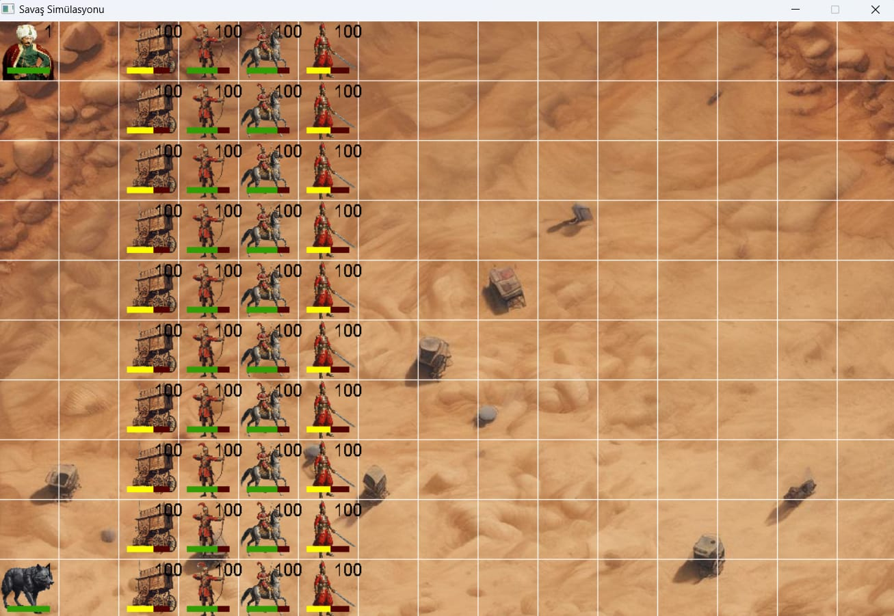

# ⚔️ İnsan İmparatorluğu ve Ork Lejyonu Stratejik Savaş Simülasyonu

Bu proje, Kocaeli Üniversitesi Bilgisayar Mühendisliği dersi kapsamında **C programlama dili** kullanılarak geliştirilmiş, iki farklı ırkın (İnsan İmparatorluğu ve Ork Lejyonu) yer aldığı **ızgara tabanlı** bir strateji oyunu simülasyonudur.

Projenin temel amacı, karmaşık algoritmalarla hesaplanan mantıksal olayların savaşın dinamiklerini nasıl etkilediğini kullanıcıya açık bir şekilde göstermektir.

## ✨ Temel Özellikler ve Savaş Mekaniği

* **Izgara Tabanlı Savaş Alanı:** Savaş, birimlerin, kahramanların ve canavarların stratejik önem taşıdığı ızgara tabanlı bir haritada gerçekleşir.
* **Detaylı Savaş Hesaplamaları:** Savaş sırasında birimlerin saldırı, savunma, sağlık, kritik vuruş ve yorgunluk gibi faktörlere dayalı olarak hesaplamalar yapılır.
* **Eş Zamanlı Saldırı Sistemi:** Birimler aynı anda saldırı yapar ve hasar miktarı, savunma gücü, birlik sayısı ve birim türlerine göre hesaplanır.
* **Kritik Vuruşlar ve Yorgunluk:** Kritik vuruşlar belirli sayıda saldırı sonrası etkinleşerek savaşın akışını değiştirir. Her adımda birliklerin saldırı gücünü %10 düşüren yorgunluk etkeni devreye girer.
* **JSON Veri İşleme:** Simülasyon, JSON dosyalarından alınan verilerin işlenmesi ve C struct yapılarına aktarılmasıyla (birlikler, kahramanlar, canavarlar) gerçekleşir.
* **Görselleştirme:** SDL2 kütüphanesi kullanılarak, savaşın başlangıç ve bitiş anları görselleştirilir. Can barları (%20 altında kırmızı, %70 üstünde yeşil) ve birlik sayıları ekranda gösterilir.
* **Orijinal Müzik ve Ambiyans:** Savaş ortamına uygun, tamamen özgün müzikler (FL STUDIO 2024 ile yapıldı) kullanılmıştır.

## 🛠️ Kullanılan Teknolojiler

| Kategori | Teknoloji | Açıklama |
| :--- | :--- | :--- |
| **Programlama** | C | Ana geliştirme dili. |
| **Görselleştirme** | SDL2, SDL_ttf, SDL2_image | Grafik, yazı ve görsel yükleme işlemleri. |
| **Veri Çekme** | cURL Kütüphanesi | Senaryo verilerini internetten URL üzerinden çekme. |
| **Görsel Tasarım** | Artbreeder, Adobe Photoshop | Karakter görselleri tasarımı ve transparanlık işlemleri. |
| **Müzik Prodüksiyonu** | FL STUDIO 2024 | Özgün oyun müziklerinin yapımı. |

## 💻 Kurulum ve Çalıştırma

Bu proje C dilinde yazılmış bir simülasyon olduğundan, çalıştırmak için uygun bir C derleyicisine (örneğin GCC) ve kullanılan kütüphanelere ihtiyacınız olacaktır.

1.  **Depoyu Klonlayın:**
    ```bash
    git clone [depo-adresiniz]
    cd [depo-adiniz]
    ```
2.  **Kütüphaneleri Kurun:** Projenin başarılı bir şekilde derlenmesi için **SDL2**, **SDL2_image**, **SDL2_ttf** ve **cURL** kütüphanelerinin sisteminizde kurulu ve projeye bağlı olması gerekir.
3.  **Derleme:**
    ```bash
    # Örnek GCC komutu, kütüphane bağlama ayarları sisteminize göre değişebilir.
    gcc main.c -o SavasSimulasyonu -lSDL2 -lSDL2_image -lSDL2_ttf -lcurl
    ```
4.  **Çalıştırma:**
    ```bash
    ./SavasSimulasyonu
    ```
    * Kodu çalıştırdığınızda önce sizden bir senaryo numarası seçmeniz istenecektir.
    * Simülasyonun başlaması için `ENTER` tuşuna basmanız gerekir.

## 📊 Deneyimsel Sonuçlar

Simülasyon, savaşın başlangıç ve bitiş anlarının görsel bir temsilini sunar.

### Savaş Öncesi Durum
Tüm birliklerin can barları %100 doludur. Sol/sağ üstte kahramanlar, sol/sağ altta ise canavarlar görünmektedir.

**Lütfen aşağıdaki görsel yolunu kendi deponuzdaki gerçek dosya yolu ile değiştirin.**


### Savaş Sonrası Durum
Savaş simüle edildikten sonra, can barlarında azalma görülür ve canı tamamen biten birlikler görsel olarak oyun sahasından kaldırılır.

**Lütfen aşağıdaki görsel yolunu kendi deponuzdaki gerçek dosya yolu ile değiştirin.**


## ✍️ Yazar Katkıları

| Geliştirici | Katkı Alanı |
| :--- | :--- |
| **Çağatay ALTINTOPAÇ** | Veri Çekme ve Ayrıştırma, Savaş Mekaniği Yansıtılması, Oyun Müzikleri, Photoshop ve Görselleştirme (Can Barı, Sayı Yazdırma) Desteği. |
| **Ali KILINÇ** | Verilerin Görselleştirilmesi, Izgara Düzeninin Sağlanması, Senaryo Verilerinin İnternetten Çekilmesi (cURL), Kodun Son Düzeni ve Okunabilirliği. |
